# @koala818

Software developer at @FreeAndFun 👋

---

<table>
<tr>
<td valign="top" width="50%">

</td>
<td valign="top" width="50%">

## Latest blog posts

<!-- blog start -->
### [Rethinking Digital Sovereignty: A European Emergency](https://www.dix31.com/en/blog/undefined-repenser-la-souverainete-numerique-une-urgence-europeenne)
*2025-02-28*

Europe's digital dependence on the United States is alarming. It is crucial to integrate digital relocation into our reindustrialisation strategies.

### [The future of the web in the face of AI: What role for content creators?](https://www.dix31.com/en/blog/the-future-of-the-web-in-the-face-of-ai-what-role-for-content-creators-l-avenir-du-web-face-aux)
*2024-12-12*

This article is a reflection on the evolution of the web and the place of independent content creators.

### [WebP: The image format that will boost your website](https://www.dix31.com/en/blog/webp-the-image-format-that-will-boost-your-website-webp-le-format-d-image-qui-va-booster-votre)
*2024-12-03*

Tired of images slowing down your website? Discover WebP, a simple but powerful solution for faster web pages!

### [Find duplicates in Compass](https://www.dix31.com/en/blog/find-duplicates-in-compass-rechercher-des-doublons-dans-compass)
*2024-11-26*

Identify which users are most referenced in other collections by counting the number of times their _id is used in them

### [HATS Pack & NX Firmware](https://www.dix31.com/en/blog/hats-pack-and-nx-firmware-hats-pack-and-nx-firmware)
*2024-11-22*

This pack includes several components, which is the latest version of Hekate, Atmosphere, Tinfoil and Signature patches and some payloads like the latest version of Lockpick_RCM, and Tegraexplorer along with its Scripts. This pack also contains the SX Gear 1.1 Boot.dat file.

<!-- blog end -->

Read more on [dix31.com](https://dix31.com/blog)

</td>
</tr>
</table>
